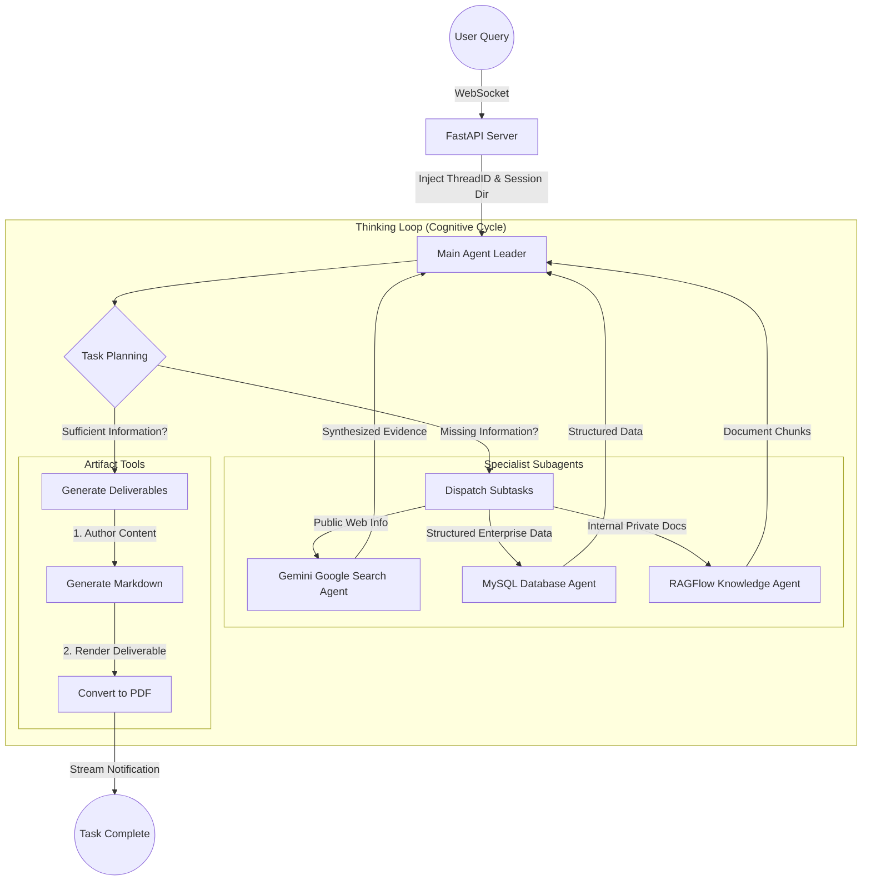

# Deep Search Project Based on DeepAgents

**Introduction**

In just a few short years, the form and paradigm of Artificial Intelligence have undergone a profound, step-by-step evolution. It has progressed from early Large Language Models (LLMs) that could only "answer queries," to AI Agents endowed with "tool-calling and execution" capabilities, and is now rapidly advancing toward **Agentic AI**—systems capable of autonomous collaboration and orchestrating complex workflows. This evolution is not a mere stacking of features; it represents a qualitative leap from *language understanding* to *autonomous action*, and ultimately to *intelligent organization and multi-agent synergy*—forming the core backbone of future intelligent applications.


To overcome existing technological bottlenecks, two pivotal concepts have rapidly emerged as core driving forces in both research and industry practice: **Deep Agents** and **Higher-Order Prompts (HOPs)**.

In the architecture of Deep Agents, the model is no longer a black-box that outputs an answer in a single shot. Instead, it becomes an autonomous agent operating within a closed loop of **"Planning → Execution → Feedback → Iteration"**:

- When faced with complex tasks, it first decomposes them into actionable sub-goals;
- It matches each sub-goal to a dedicated sub-agent for specialized division of labor;
- During execution, it continuously monitors intermediate outputs to identify anomalies and course deviations;
- Based on execution feedback, it dynamically adjusts plans, substitutes strategies, or spawns new subtasks to fill gaps;
- When encountering errors, it uses reflection mechanisms to trace root causes and correct execution paths.

Meanwhile, **Higher-Order Prompts (HOPs)** focus on *teaching models how to think*: If Deep Agents are the "organizational architects" that establish the execution framework, Higher-Order Prompts are the "cognitive directors" defining underlying reasoning logic and thought processes.

* **Traditional Prompt**: Tells the model **what to do**.

  > Analyze the following user review, determine whether the sentiment is positive, negative, or neutral, and provide suggestions for improvement.
  >
  > Review: "This app lags constantly, takes forever to open, has an ugly interface, and is frustrating to use."

* **Higher-Order Prompt (HOP)**: Tells the model **how to think, which steps to follow, and what logic to apply**.

  > Please analyze the user review using the following **structured reasoning workflow**:
  >
  > 1. **Extract facts sentence-by-sentence**: What specific issues did the user mention?
  > 2. **Assess sentiment**: Determine if sentiment is positive, negative, or neutral based on key phrases, providing clear reasoning.
  > 3. **Rank by severity**: Order issues from most critical to least impactful on user experience.
  > 4. **Actionable suggestions**: Provide concrete, actionable remediation steps for each issue (avoid generic platitudes).
  > 5. **Core summary**: Summarize the primary pain point in a single concise sentence.
  >
  > Review: "This app lags constantly, takes forever to open, has an ugly interface, and is frustrating to use."

Traditional prompts focus on commanding direct outcomes, while Higher-Order Prompts convey structured cognitive frameworks and reasoning paradigms. This fundamentally elevates decision precision and execution reliability.

---

## 1. DeepAgents Framework Core

### 1.1 Introduction and Role of DeepAgents

> Build agents capable of planning, leveraging subagents, and using virtual filesystems to tackle complex tasks.
>
> Official Documentation: https://docs.langchain.com/oss/python/deepagents/overview

**DeepAgents** is an autonomous multi-agent library built on top of LangChain agent building blocks (analogous to the relationship between Spring Boot and the Spring Framework). It specializes in **Agentic AI** systems. DeepAgents is the simplest way to build LLM-powered applications equipped with built-in task planning, filesystem-based context management, subagent delegation, and long-term memory. It empowers developers to solve complex, multi-step, autonomous planning tasks.

#### Framework Family Comparison

> Official Concepts: https://docs.langchain.com/oss/python/concepts/products
>
> Note: These three layers are not strictly unidirectional; cyclic delegations and co-invocations can occur in advanced architectures.

- **LangChain (Framework)**: Executes **"Actions"**—the foundational agent framework. It encapsulates LLM interactions and tool calling, providing flexible agent abstractions without opinionated planning, persistent memory, or filesystem mechanisms.
- **LangGraph (Runtime)**: Manages **"Workflows"**—the outer runtime engine. It models execution as controllable state graphs, supporting cycles, branching, parallel branches, and durable persistence.
- **DeepAgents (Harness)**: Handles **"Organization"**—the outermost agentic toolkit. It features built-in planners, subagents, virtual filesystems, and durable memory storage, elevating agents from basic task executors to autonomous entities capable of organization, management, and reflection.


#### Feature Matrix Comparison


#### Use Case Decision Matrix

1. **When to use LangChain?**
   - Rapidly building single agents and standalone autonomous utilities.
   - Standard abstractions for models, tools, and basic agent loops are sufficient.
   - Clean, lightweight, and flexible development workflows.
   - Developing simple, straightforward agent applications without complex orchestration.

2. **When to use LangGraph?**
   - Fine-grained, low-level control over agent orchestration and state transitions is required.
   - Long-running, stateful, durable execution across multiple sessions.
   - Combining deterministic rule steps with non-deterministic agentic steps in complex cyclic workflows.
   - Building production-grade agent deployment infrastructure.

3. **When to use DeepAgents SDK?**
   - Building long-running, self-operating, autonomous planning agents.
   - Handling complex, multi-step, open-ended research or engineering tasks.
   - Leveraging built-in utilities: virtual filesystems, custom tools, automated context engineering, and memory offloading.
   - Utilizing out-of-the-box subagent hierarchies and prompt templates.

---

### 1.2 Core Capabilities of DeepAgents

#### Core Capability 1: Intelligent Planning & Task Decomposition (Eliminating Static Workflow Rigidity)

> DeepAgents provides built-in `write_todos` tooling, enabling agents to:
> - Decompose complex instructions into discrete execution steps.
> - Track task execution progress in real time.
> - Dynamically adapt and adjust plans based on incoming runtime discoveries.

*Example*: If instructed to "organize a company summit," DeepAgents will not execute blindly. Instead, it formulates an actionable todo list:
`1. Determine date/venue → 2. Invite speakers → 3. Procure catering/equipment → 4. Set up hall → 5. Run rehearsal`
During execution, it marks items as completed/pending. If a speaker cancels, it dynamically revises the plan to invite a backup speaker.

> *Note*: `write_todos` is a built-in tool function within DeepAgents:
> - `read_todos`: Reads the current todo checklist to guide next actions.
> - `update_todos`: Modifies steps or adjusts priorities based on intermediate findings.
> - `delete_todos`: Prunes redundant or obsolete steps.

#### Core Capability 2: Efficient Context Management (Offloading Memory to Avoid Context Overflow)

> DeepAgents includes virtual filesystem tools (`ls`, `read_file`, `write_file`, `edit_file`), enabling agents to:
> - Offload voluminous raw data and intermediate outputs to external storage.
> - Prevent LLM context window overflow and attention degradation.
> - Manage variable-length execution results smoothly.

*Analogy*: When summarizing a 100-page dossier, an agent's context window can quickly saturate. DeepAgents provides an external filing cabinet:
1. Splits raw data into files stored in the backend workspace.
2. Reads only relevant sections (`read_file`) on demand.
3. Writes intermediate drafts (`write_file`) and updates them (`edit_file`).
4. Keeps the active LLM context clean, focused, and token-efficient.

#### Core Capability 3: Subagent Spawning Mechanism (Hierarchical Specialization & Context Isolation)

> DeepAgents provides a built-in `task` tool, enabling agents to:
> - Delegate specialized subtasks to dedicated subagents.
> - Isolate execution contexts, preventing intermediate tool noise from polluting the main agent's context.
> - Execute deep, multi-turn reasoning loops in isolated sub-environments.

*Analogy*: When building an enterprise application, the Project Manager (Main Agent) delegates UI design to a Designer Subagent, backend logic to a Coder Subagent, and database schemas to a DBA Subagent. Each subagent operates independently with specialized tools, returning only distilled summaries to the Leader.

#### Core Capability 4: Long-Term Memory (Cross-Thread Knowledge Persistence)

> DeepAgents integrates LangGraph's durable Store mechanism, enabling agents to:
> - Extend cross-thread, cross-session persistent memory.
> - Save, index, and retrieve historical conversation records and user profiles.
> - Share institutional knowledge across multiple collaborating agents.

---

### 1.3 DeepAgents Quickstart

Let's build your first Deep Agent: **An Autonomous AI Researcher that searches the web and writes reports** powered by Gemini's Grounding with Google Search.

> **Why Gemini Search Grounding over Traditional Search APIs?**
> Gemini's `google_search` grounding integrates search directly within the model runtime: a single API call performs search query generation, web page crawling, comprehension, and synthesis. It directly returns a coherent natural-language response accompanied by `grounding_metadata` (actual search queries and source URLs). This eliminates transmitting massive raw HTML/JSON back and forth, significantly lowering token overhead and providing native citation tracking.

#### Step 1: Install Dependencies

```bash
pip install deepagents google-genai python-dotenv langchain-openai
```

#### Step 2: Configure Environment Variables (`.env`)

```ini
# OpenAI-compatible LLM Configuration
OPENAI_BASE_URL=https://dashscope.aliyuncs.com/compatible-mode/v1
OPENAI_API_KEY=your-openai-or-dashscope-api-key
LLM_QWEN3=qwen3-32b
LLM_QWEN_MAX=qwen-max

# Google Gemini API Configuration (https://aistudio.google.com/apikey)
GEMINI_API_KEY=your-gemini-api-key
GEMINI_MODEL=gemini-3.6-flash
```

#### Step 3: Define Search Tool (`gemini.py`)

```python
import os
from dotenv import find_dotenv, load_dotenv
from google import genai
from google.genai import types
from langchain_core.tools import tool

# Load .env file
load_dotenv(find_dotenv())

GEMINI_MODEL = os.getenv("GEMINI_MODEL", "gemini-3.6-flash")

# Initialize Gemini client
client = genai.Client(api_key=os.getenv("GEMINI_API_KEY"))

# Define web search tool
@tool("gemini_web_search")
def gemini_web_search(query: str) -> str:
    """
    Internet search tool powered by Google Search via Gemini grounding.
    :param query: A complete, self-contained search query.
    :return: Synthesized answer + search queries used + source links.
    """
    print(f"[Web Search] Query: {query}")
    response = client.models.generate_content(
        model=GEMINI_MODEL,
        contents=query,
        config=types.GenerateContentConfig(
            # Enable Google Search grounding
            tools=[{"google_search": {}}],
        ),
    )

    parts = [response.text or "(No content returned)"]

    # Extract grounding metadata: queries and source URLs
    candidates = response.candidates
    metadata = candidates[0].grounding_metadata if candidates else None
    if metadata:
        if metadata.web_search_queries:
            parts.append("Search queries used: " + ", ".join(metadata.web_search_queries))
        if metadata.grounding_chunks:
            sources = [
                f"  [{i + 1}] {chunk.web.title}: {chunk.web.uri}"
                for i, chunk in enumerate(metadata.grounding_chunks)
                if chunk.web
            ]
            if sources:
                parts.append("Sources:\n" + "\n".join(sources))

    return "\n\n".join(parts)
```

#### Step 4: Assemble Deep Agent

```python
import os
from dotenv import find_dotenv, load_dotenv
from langchain.chat_models import init_chat_model
from deepagents import create_deep_agent
from gemini import gemini_web_search

load_dotenv(find_dotenv())

# Initialize LLM
llm = init_chat_model(
    model=os.getenv("LLM_QWEN_MAX"),
    model_provider="openai"
)

# Factory creation of Deep Agent
deep_agent = create_deep_agent(
    model=llm,
    tools=[gemini_web_search],
    subagents=[],
    system_prompt="""
      You are an expert research analyst. Your duty is to conduct thorough investigation and author polished reports.
      You have access to the gemini_web_search tool to gather verified web information. Always preserve source citations in your findings.
    """
)
```

#### Step 5: Execute and Inspect Results

```python
prompt = input("Enter your research topic: ")
result = deep_agent.invoke({
    "messages": [
        {"role": "user", "content": prompt}
    ]
})

# Print final distilled output
print(result['messages'][-1].content)
```

---

### 1.4 DeepAgents Streaming & Chunk Parsing

DeepAgents is built on LangGraph's streaming infrastructure. When delegating tasks to subagents, updates from each node can be streamed in real time to monitor thoughts, tool calls, and subagent lifecycles.

```python
prompt = input("Enter your query: ")
stream = deep_agent.stream({
    "messages": [{"role": "user", "content": prompt}]
})

for chunk in stream:
    for node_name, state in chunk.items():
        print(f"Active Node: {node_name}")
        if not state or "messages" not in state:
            continue
        messages = state["messages"]
        if messages and isinstance(messages, list):
            last_msg = messages[-1]
            # 1. Model Node (model): Deciding next action
            if node_name == "model":
                if last_msg.tool_calls:
                    for tool_call in last_msg.tool_calls:
                        if tool_call['name'] == 'task':
                            sub_agent = tool_call['args'].get('subagent_type')
                            print(f"[Decision] Delegating to subagent: {sub_agent}")
                        else:
                            print(f"[Decision] Invoking tool: {tool_call['name']} with args {tool_call['args']}")
                elif last_msg.content:
                    print(f"[Final Output] {last_msg.content}")

            # 2. Tools Node (tools): Execution results
            elif node_name == "tools":
                content_preview = last_msg.content[:100] + "..." if len(last_msg.content) > 100 else last_msg.content
                print(f"[Tool Result] {content_preview}")
```

#### Stream Node Lifecycle Breakdown

1. **Preprocessing (`PatchToolCallsMiddleware.before_agent`)**: Formats and validates input messages.
2. **Model Reasoning (`model`)**: Analyzes instructions and decides whether to invoke tools, subagents, or reply directly.
3. **Post-Model Hook (`TodoListMiddleware.after_model`)**: Internal planning state synchronization.
4. **Tool Execution (`tools`)**: Executes external integrations (web search, SQL, filesystem) and returns results.
5. **Final Output (`model`)**: Generates comprehensive natural language responses.

---

### 1.5 Subagents and Multi-Agent Systems (MAS)

#### 1.5.1 Multi-Agent Fundamentals

A Multi-Agent System (MAS) consists of multiple autonomous, reactive, and goal-directed agents collaborating through standardized communication protocols.

| Dimension | Monolithic LLM (Attention Dilution) | Multi-Agent Architecture (Divide & Conquer) |
| :--- | :--- | :--- |
| **Core Limitation** | A single model attempts to handle multiple disparate domains (e.g., Medicine + Law + Code), leading to knowledge interference and reasoning degradation. | Tasks are decomposed physically; specialized agents handle isolated subtasks in parallel, dramatically improving quality. |
| **Analogy** | Solo full-stack generalist (spread thin, lacks depth). | Agile specialized team (clear division of labor, deep domain expertise). |
| **Cognitive Load** | Attention budget is diluted across excessive tokens. | Distributed reasoning + modular context guarantees clean cognitive focus. |

#### 1.5.2 Costs & Pitfalls of Multi-Agent Systems

1. **Exponential Token Consumption**:
   When multiple agents exchange verbose conversation histories and intermediate tool logs across multiple cycles, token consumption can skyrocket exponentially.
   *Remediation*: Implement intercept thresholds. Route simple queries to single agents and enforce concise communication boundaries.
2. **Debugging Non-Determinism & Distributed Tracing**:
   Multi-agent emergent behaviors introduce non-linear interactions. A failure is rarely isolated to one node.
   *Remediation*: Full-link tracing (`Tracing`) and structured event logging are mandatory before deploying multi-agent systems to production.

#### 1.5.3 Three Golden Rules for Multi-Agent Adoption

Only deploy a Multi-Agent architecture if at least one of these criteria is met:
1. **Open-Ended, Non-Deterministic Tasks**: High-complexity workflows with no fixed single-path answer (e.g., enterprise strategy planning, deep scientific synthesis).
2. **Domain Conflicts**: Tasks spanning distinct domain boundaries requiring separate context silos to prevent cross-domain hallucination.
3. **Multi-Branch Parallelism**: Workflows that naturally decompose into independent parallel paths (e.g., parallel data scraping, multi-version document drafting).

#### 1.5.4 Multi-Agent Architecture Patterns

- **Pattern 1: Hierarchical (Orchestrator-Workers)**: Centralized coordination. A Leader Agent plans, delegates subtasks to specialized Worker Agents, and aggregates the results. *(DeepAgents standard)*
- **Pattern 2: Collaborative (Peer-to-Peer / Network)**: Decentralized collaboration. Peer agents communicate directly through a shared blackboard/context state. *(AutoGen standard)*


#### 1.5.5 Subagent Configuration Schema

In DeepAgents, subagents can be configured as dictionaries or `CompiledSubAgent` objects:

| Field | Type | Required | Description | Inheritance Rule |
| :--- | :--- | :--- | :--- | :--- |
| `name` | `str` | Yes | Unique identifier used by the main agent during `task()` dispatch. | None (Must define) |
| `description` | `str` | Yes | Functional description guiding the main agent on when to route tasks here. | None (Must define) |
| `system_prompt`| `str` | Optional | Custom execution instructions, persona, and output constraints. | Independent (Does not inherit) |
| `tools` | `list[Callable]`| Optional | Specialized tools accessible to this subagent. | Independent (Does not inherit) |
| `model` | `str \| BaseChatModel` | Optional | LLM powering this subagent (e.g., `"openai:gpt-4o"`, `"google_genai:gemini-3.6-flash"`). | Defaults to Main Agent model |
| `middleware` | `list[Middleware]` | Optional | Middleware hooks for logging, rate limiting, or validation. | Independent |
| `skills` | `list[str]` | Optional | Virtual filesystem paths to external `SKILL.md` packages. | Independent |

#### Subagent Code Example

```python
import os
from dotenv import find_dotenv, load_dotenv
from langchain.chat_models import init_chat_model
from deepagents import create_deep_agent

load_dotenv(find_dotenv())

llm = init_chat_model(model=os.getenv("LLM_QWEN_MAX"), temperature=0.1, model_provider="openai")

# 1. Weather Subagent
weather_agent = {
    "name": "weather_helper",
    "description": "Used to query weather information for any given city.",
    "system_prompt": "You are a weather assistant. Provide current meteorological conditions and recommendations.",
    "tools": []
}

# 2. Math Subagent
math_agent = {
    "name": "math_helper",
    "description": "Specialized in performing rigorous mathematical calculations.",
    "system_prompt": "You are a precise mathematics assistant.",
    "tools": []
}

# 3. Translation Subagent
translate_agent = {
    "name": "translator",
    "description": "Translates text seamlessly between English and Chinese.",
    "system_prompt": "You are an expert bilingual translator.",
    "tools": []
}

# 4. Main Agent with Subagents registered
main_agent = create_deep_agent(
    model=llm,
    tools=[],
    subagents=[weather_agent, math_agent, translate_agent],
    system_prompt="You are an executive butler. Dispatch tasks to the appropriate specialist assistant based on user requests."
)
```

---

### 1.6 LangGraph & LangChain Interoperability

DeepAgents can mount standard LangGraph compiled graphs and LangChain agents as subagents via `CompiledSubAgent`:

```python
import os
from typing import Annotated, TypedDict
from langchain_core.messages import AIMessage
from langgraph.graph import StateGraph, END
from langgraph.graph.message import add_messages
from deepagents import create_deep_agent, CompiledSubAgent
from langchain.chat_models import init_chat_model

class SubState(TypedDict):
    messages: Annotated[list, add_messages]

def processing_node(state: SubState):
    last_msg = state["messages"][-1]
    result_text = f"[Graph Processed] Verified business logic: {last_msg.content}"
    return {"messages": [AIMessage(content=result_text)]}

workflow = StateGraph(SubState)
workflow.add_node("worker", processing_node)
workflow.set_entry_point("worker")
workflow.add_edge("worker", END)
compiled_graph = workflow.compile()

# Wrap compiled graph into CompiledSubAgent
sub_agent_config = CompiledSubAgent(
    name="complex_worker",
    description="Subagent for executing intricate business logic and validation audits.",
    runnable=compiled_graph
)

llm = init_chat_model(model=os.getenv("LLM_QWEN_MAX"), model_provider="openai")

deep_agent = create_deep_agent(
    model=llm,
    subagents=[sub_agent_config],
    system_prompt="You are a supervisor. Delegate complex verification tasks to complex_worker."
)
```

---

### 1.7 Human-in-the-Loop (HITL) Workflows

Sensitive tools (e.g., deleting databases or modifying files) can trigger human approval pauses using `interrupt_on` and durable checkpoints.


```python
import os
from langchain.chat_models import init_chat_model
from langchain.tools import tool
from deepagents import create_deep_agent
from langgraph.checkpoint.memory import InMemorySaver
from langgraph.types import Command
from dotenv import load_dotenv, find_dotenv

load_dotenv(find_dotenv())

@tool
def delete_database(table_name: str):
    """High-risk action: Delete database table."""
    return f"Successfully dropped table: {table_name}"

@tool
def select_data(table_name: str):
    """Normal action: Query table data."""
    return f"Retrieved data for table: {table_name}"

checkpointer = InMemorySaver()
llm = init_chat_model(model=os.getenv("LLM_QWEN_MAX"), model_provider="openai")

deep_agent = create_deep_agent(
    model=llm,
    tools=[delete_database, select_data],
    interrupt_on={"delete_database": True},  # Require approval for high-risk operations
    checkpointer=checkpointer,
    system_prompt="Always execute operations faithfully following user confirmation."
)

thread_config = {"configurable": {"thread_id": "audit_session_1"}}

# Step 1: Trigger planning and pause at interrupt
result_1 = deep_agent.invoke(
    {"messages": [{"role": "user", "content": "Delete table users and then select products."}]},
    config=thread_config
)

interrupts = result_1.get("__interrupt__")
if interrupts:
    action_requests = interrupts[0].value['action_requests']
    print(f"Approval required for actions: {[a['name'] for a in action_requests]}")

    # Step 2: Resume with approved / rejected / edited decisions
    decisions = [{"type": "approve"}]
    final_result = deep_agent.invoke(
        Command(resume={"decisions": decisions}),
        config=thread_config
    )
    print(final_result["messages"][-1].content)
```

---

### 1.8 Backends & Virtual Filesystems

DeepAgents abstracts storage via **Backends**—a virtual filesystem interface that decouples agent file operations (`read_file`, `write_file`, `edit_file`) from physical storage layers.


| Backend Type | Storage Medium | Ideal Use Case | Analogy |
| :--- | :--- | :--- | :--- |
| **StateBackend** *(Default)* | Memory (State) | Ephemeral files, scratchpads. Destroyed when session ends. | Incognito browser mode |
| **FilesystemBackend** | Local disk | Local development, direct artifact inspection. | Local hard drive |
| **StoreBackend** | Database (KV Store) | Distributed production, cross-agent persistent memory (Redis/PostgreSQL). | Cloud drive (S3/iCloud) |
| **CompositeBackend** | Hybrid router | Enterprise production: routes `/store/*` to DB and regular files to disk. | OS Disk + Cloud Mount |

#### CompositeBackend Example

```python
from pathlib import Path
import os
from deepagents import create_deep_agent
from deepagents.backends import StoreBackend, FilesystemBackend, CompositeBackend
from langgraph.store.memory import InMemoryStore
from langchain.chat_models import init_chat_model

store = InMemoryStore()
llm = init_chat_model(model=os.getenv("LLM_QWEN_MAX"), model_provider="openai")

def create_composite_backend(runtime):
    workspace_dir = Path("./agent_workspace").resolve()
    workspace_dir.mkdir(parents=True, exist_ok=True)
    fs_backend = FilesystemBackend(root_dir=workspace_dir, virtual_mode=True)
    store_backend = StoreBackend(runtime)

    return CompositeBackend(
        default=fs_backend,
        routes={"/store/": store_backend}
    )

agent = create_deep_agent(
    model=llm,
    store=store,
    backend=create_composite_backend,
    tools=[],
    system_prompt="Save standard deliverables locally, and persistent memories under /store/."
)
```

---

### 1.9 Middleware System

Middleware intercepts execution across key lifecycle events (pre/post tool calls, model calls) to provide audit logs, metrics, or parameter guards:

```python
import time
from langchain.agents.middleware import wrap_tool_call
from langchain.chat_models import init_chat_model
from langchain.tools import tool
from deepagents import create_deep_agent

@tool
def add_numbers(a: int, b: int) -> int:
    """Calculate the sum of two numbers."""
    return a + b

@wrap_tool_call
def log_tool_call(request, handler):
    tool_name = request.tool_call["name"]
    tool_args = request.tool_call["args"]
    print(f"[Middleware] Invoking {tool_name} with {tool_args}")
    start = time.time()
    result = handler(request)
    duration = time.time() - start
    print(f"[Middleware] Completed {tool_name} in {duration:.2f}s")
    return result
```

---

### 1.10 Agent Skills Extension

**Skills** allow injecting domain-specific capabilities into agents dynamically using structured markdown definition packages (`SKILL.md`) without polluting the base prompt.

#### Standard Skill Directory Structure

```text
skill-code-reviewer/
├── SKILL.md              # Core skill instructions & metadata (Required)
├── requirements.txt      # Dependency specifications (Optional)
├── resources/            # Templates, examples, and schemas (Optional)
└── scripts/              # Helper execution scripts (Optional)
```

#### Standard `SKILL.md` Format

```markdown
---
name: code-reviewer
description: Use this skill when asked to perform a code review or detect security bugs.
---
# Code Reviewer Skill

## Instructions
1. Security Audit: Check for SQL Injection, path traversal, hardcoded secrets.
2. Performance Optimization: Identify duplicate loops or memory leaks.
3. Code Style: Enforce PEP 8 formatting.
4. Output Format: Present findings in a structured Markdown table with a score (0-100).
```

---

## 2. Deep Search Project Overview

This project represents a production-grade best practice implementation of the DeepAgents framework: **An Autonomous Deep Research System**.


### 2.1 Project Objectives
The system emulates the cognitive methodology of senior research analysts through a multi-agent cooperative architecture (1 Leader + N Specialists). It transcends single-turn RAG retrieval by executing iterative **Search → Read → Reflect → Re-Search** loops, discovering hidden patterns across heterogeneous data sources with high precision, broad coverage, and authoritative citations.

### 2.2 Agent Architecture

The system adopts a **1 Leader + N Specialists** hierarchical design:



#### Roles and Responsibilities
* **Main Agent (Project Manager / Leader)**:
  - Understands user requirements, drafts todo plans, coordinates specialists, and synthesizes final multi-page reports.
  - Controls session lifecycle, memory, and output artifacts.
* **Specialist Subagents**:
  - **Web Search Assistant**: Conducts multi-angle, deep iterative searches on the public internet (up to 5 iterations, 3+ perspectives) with verified citations.
  - **Database Query Assistant**: Queries internal relational databases (MySQL) to extract exact tabular metrics, inventory levels, and transactional sales records via Text-to-SQL.
  - **RAGFlow Assistant**: Queries private corporate knowledge bases to retrieve proprietary manuals, clinical trials, and internal regulations.

### 2.3 Tool Matrix

| Agent | Tool Name | Description |
| :--- | :--- | :--- |
| **Main Agent** | `generate_markdown` | Writes structured Markdown reports to the session directory. |
| **Main Agent** | `convert_md_to_pdf` | Converts generated Markdown documents into formatted PDF files. |
| **Main Agent** | `read_file_content` | Reads and parses user-uploaded files (`.md`, `.docx`, `.pdf`, `.xlsx`). |
| **Web Search Agent** | `gemini_web_search` | Multi-turn internet grounding via Google Search with citations. |
| **Database Agent** | `list_sql_tables` | Discovers available relational schema tables. |
| **Database Agent** | `get_table_data` | Previews the first 100 rows of a table in CSV format. |
| **Database Agent** | `execute_sql_query` | Executes customized SQL queries on MySQL. |
| **RAGFlow Agent** | `get_assistant_list` | Queries available RAGFlow knowledge base assistants. |
| **RAGFlow Agent** | `create_ask_delete` | Dispatches single-turn deep queries to target RAG assistants. |

### 2.4 Technology Stack

- **LangChain / LangGraph / DeepAgents**: Core orchestration, cyclic state graphs, and subagent hierarchies.
- **FastAPI & Uvicorn**: High-performance asynchronous REST API backend.
- **WebSockets**: Real-time bi-directional streaming of agent thoughts and tool logs.
- **Google GenAI SDK (`gemini-3.6-flash`)**: Built-in Google Search Grounding for internet research.
- **RAGFlow SDK**: Enterprise knowledge base integration.
- **MySQL Connector & SQLAlchemy**: Secure relational database operations.
- **PyPDF, python-docx, pandas, openpyxl**: Multi-format document parser.
- **ContextVars**: Async thread-safe session isolation for high-concurrency environments.

---

## 3. Project Setup Guide

### 3.1 Project Structure

```text
DeepAgents/
├── agent/
│   ├── sub_agents/
│   │   ├── __init__.py
│   │   ├── database_query_agent.py  # MySQL Database specialist
│   │   ├── knowledge_base_agent.py  # RAGFlow knowledge specialist
│   │   └── network_search_agent.py  # Gemini Web Search specialist
│   ├── llm.py                       # LLM initialization
│   ├── main_agent.py                # Main Agent orchestration & execution runtime
│   └── prompts.py                   # YAML prompt loader
├── api/
│   ├── __init__.py
│   ├── context.py                   # ContextVars session isolation
│   ├── logger.py                    # Structured logging system
│   ├── monitor.py                   # WebSocket event dispatcher singleton
│   └── server.py                    # FastAPI server & endpoints
├── prompt/
│   └── prompts.yaml                 # System prompt configurations
├── sql/
│   └── company_data.sql             # Relational database schema & seed data
├── tools/
│   ├── __init__.py
│   ├── gemini_tools.py              # Gemini Google Search grounding
│   ├── markdown_tools.py            # Markdown artifact generator
│   ├── mysql_tools.py               # Database inspection & query tools
│   ├── pdf_tools.py                 # PDF converter tool
│   ├── ragflow_tools.py             # RAGFlow API client tools
│   └── upload_file_read_tool.py     # Multi-format file reader
├── utils/
│   ├── path_utils.py                # Virtual-to-physical path resolver
│   └── word_converter.py            # Word/HTML-to-PDF conversion engine
├── ui/                              # Frontend React/Vite application
├── output/                          # Auto-generated session workspace folders
├── updated/                         # Temporary upload staging area
├── .env                             # Environment variables & API keys
└── pyproject.toml / requirements.txt
```

### 3.2 Dependencies (`requirements.txt`)

```ini
# Deep Agents Core
deepagents>=0.1.0

# LangChain Ecosystem
langchain>=0.2.0
langchain-core>=0.2.0
langchain-community>=0.2.0
langgraph>=0.1.0
langchain-openai>=0.1.0
langchain-google-genai>=2.0.0
openai>=1.0.0

# Web & Networking
fastapi>=0.100.0
uvicorn[standard]>=0.20.0
python-multipart>=0.0.6
requests>=2.31.0
aiofiles>=23.0.0

# Database
mysql-connector-python>=8.0.0

# Document & File Processing
python-docx>=1.0.0
pypdf>=3.0.0
pandas>=2.0.0
openpyxl>=3.1.0
markdown>=3.5.0

# Google Gemini & RAG Integrations
google-genai>=1.0.0
ragflow-sdk>=0.1.0

# Utilities
PyYAML>=6.0
pydantic>=2.0.0
python-dotenv>=1.0.0
typing-extensions>=4.5.0
```

Install via:
```bash
pip install -r requirements.txt
```

### 3.3 Frontend Deployment (`ui/`)

Ensure **Node.js (v20.x+)** is installed:
```bash
cd ui
npm install
npm run dev
```
Access the web dashboard at `http://localhost:5173`.

---

### 3.4 API Communication Infrastructure

#### 3.4.1 Session Isolation (`api/context.py`)

```python
from contextvars import ContextVar
from typing import Optional

_session_dir_ctx: ContextVar[Optional[str]] = ContextVar("session_dir", default=None)
_thread_id_ctx: ContextVar[Optional[str]] = ContextVar("thread_id", default=None)

def set_session_context(path: str):
    return _session_dir_ctx.set(path)

def get_session_context() -> Optional[str]:
    return _session_dir_ctx.get()

def set_thread_context(thread_id: str):
    return _thread_id_ctx.set(thread_id)

def get_thread_context() -> Optional[str]:
    return _thread_id_ctx.get()

def reset_session_context(session_token, thread_token=None):
    _session_dir_ctx.reset(session_token)
    if thread_token:
        _thread_id_ctx.reset(thread_token)
```

#### 3.4.2 Real-time Monitoring & WebSocket (`api/monitor.py`)

```python
import datetime
import asyncio
from typing import Any, Dict, Optional
from fastapi import WebSocket
from api.context import get_thread_context

class ToolMonitor:
    _instance = None
    
    def __new__(cls):
        if cls._instance is None:
            cls._instance = super(ToolMonitor, cls).__new__(cls)
            cls._instance.websocket_manager = None
        return cls._instance

    def set_websocket_manager(self, manager):
        self.websocket_manager = manager

    def _emit(self, event_type: str, message: str, data: Optional[Dict[str, Any]] = None):
        payload = {
            "type": "monitor_event",
            "event": event_type,
            "message": message,
            "data": data or {},
            "timestamp": datetime.datetime.now().isoformat()
        }

        if self.websocket_manager:
            try:
                thread_id = get_thread_context()
                manager_loop = self.websocket_manager.get_loop()
                if manager_loop and thread_id:
                    try:
                        current_loop = asyncio.get_running_loop()
                    except RuntimeError:
                        current_loop = None

                    if current_loop and current_loop == manager_loop:
                        current_loop.create_task(
                            self.websocket_manager.send_to_thread(payload, thread_id)
                        )
                    else:
                        asyncio.run_coroutine_threadsafe(
                            self.websocket_manager.send_to_thread(payload, thread_id), 
                            manager_loop
                        )
            except Exception as e:
                print(f"[Monitor] WebSocket broadcast failed: {e}")

        print(f"[Monitor:{event_type}] {message}")

    def report_tool(self, tool_name: str, args: Dict[str, Any] = None):
        self._emit("tool_start", f"Invoking tool: {tool_name}", {"tool_name": tool_name, "args": args})

    def report_assistant(self, assistant_name: str, args: Dict[str, Any] = None):
        self._emit("assistant_call", f"Calling subagent: {assistant_name}", {"assistant_name": assistant_name, "args": args})

    def report_task_result(self, result: str):
        self._emit("task_result", "Task execution finished", {"result": result})

    def report_session_dir(self, path: str):
        self._emit("session_created", f"Workspace ready: {path}", {"path": path})

monitor = ToolMonitor()

class ConnectionManager:
    def __init__(self):
        self.active_connections: Dict[str, WebSocket] = {}
        self.loop = None

    def get_loop(self):
        if self.loop is None:
            try:
                self.loop = asyncio.get_running_loop()
                monitor.set_websocket_manager(self)
            except RuntimeError:
                pass
        return self.loop

    async def connect(self, websocket: WebSocket, thread_id: str):
        self.get_loop()
        await websocket.accept()
        self.active_connections[thread_id] = websocket

    def disconnect(self, websocket: WebSocket, thread_id: str):
        if thread_id in self.active_connections:
            del self.active_connections[thread_id]

    async def send_to_thread(self, message: dict, thread_id: str):
        if thread_id in self.active_connections:
            await self.active_connections[thread_id].send_json(message)

manager = ConnectionManager()
```

#### 3.4.3 Path Sanitization (`utils/path_utils.py`)

```python
import os
from pathlib import Path
from typing import Optional

def resolve_path(filename: str, session_dir: Optional[str] = None) -> str:
    """
    Sanitizes LLM virtual paths (/workspace, /mnt/data, etc.) and guarantees
    all read/write operations resolve safely inside the active session directory.
    """
    path_str = filename.replace("\\", "/")

    # 1. Clean virtual prefixes hallucinated by LLMs
    virtual_prefixes = ["/workspace", "/mnt/data", "/home/user"]
    for prefix in virtual_prefixes:
        if path_str.startswith(prefix):
            path_str = path_str[len(prefix):].lstrip("/")
            break

    # 2. Upload directory handling
    if "updated/" in path_str:
        idx = path_str.find("updated/")
        return str(Path(path_str[idx:]).resolve())

    path = Path(path_str)
    if not session_dir:
        return str(path.resolve())

    session_path = Path(session_dir).resolve()
    session_name = session_path.name

    # 3. Handle Absolute vs Relative path nesting
    if path.is_absolute():
        try:
            if session_path in path.parents or path == session_path:
                return str(path)
        except Exception:
            pass
        return str(path)
    else:
        if session_name in path.parts:
            return str(session_path / path.name)
        if path.parts and path.parts[0] == "output":
            return str(session_path / path.name)
        return str(session_path / path)
```

---

## 4. Feature Implementation & Testing

### 4.1 LLM Initialization (`agent/llm.py`)

```python
import os
from dotenv import load_dotenv, find_dotenv
from langchain.chat_models import init_chat_model

load_dotenv(find_dotenv())

model = init_chat_model(
    model=os.getenv("LLM_QWEN_MAX", "qwen-max"),
    model_provider="openai"
)
```

### 4.2 Prompt Configuration (`prompt/prompts.yaml` & `agent/prompts.py`)

#### Prompt File (`prompt/prompts.yaml`)

```yaml
main_agent:
  system_prompt: |
    You are the Lead Research Orchestrator for Wohua Pharmaceutical Intelligence Team.
    Your mission is to coordinate three specialized expert assistants to solve complex analytical research tasks.

    Your team members:
    1. **Web Search Assistant (gemini)**: Responsible for external internet information retrieval, competitive intelligence, and industry trends.
    2. **Database Query Assistant (db)**: Responsible for querying enterprise relational database (pharma_db) to obtain structured drug details, inventory records, and sales volumes.
    3. **RAGFlow Assistant (ragflow)**: Responsible for querying proprietary internal knowledge bases for confidential corporate documents and regulations.

    Operational Rules:
    - Execution Sequence:
      1. Always invoke specialist subagents first to gather complete information.
      2. NEVER invoke document generation tools before obtaining factual data.
      3. Only call generate_markdown once comprehensive text is assembled.
    - Workspace Constraints:
      All file operations must be performed strictly within the designated session directory provided at runtime.
    - Output Format:
      Generate thorough, well-structured Markdown reports (>1000 words) containing actionable todo checklists and verified citation links. Convert to PDF when requested.

sub_agents:
  gemini:
    name: "Web Search Assistant"
    description: |
      Specialist agent for public internet knowledge retrieval. Use this assistant when searching for news, industry reports, clinical studies, or non-confidential external data.
    system_prompt: |
      You are an expert web research assistant. Query public web information using the gemini_web_search tool.
      Ensure each query is self-contained. Search across at least 3 distinct perspectives, up to a maximum of 5 iterations.
      Preserve all source citation URLs in your compiled output.

  db:
    name: "Database Query Assistant"
    description: |
      Specialist agent for enterprise structured SQL data. Queries tables, previews schemas, and executes analytical SQL queries against the pharmaceutical database.
    system_prompt: |
      You are a specialized SQL database assistant.
      Follow the 3-step workflow: 1. list_sql_tables -> 2. get_table_data (preview) -> 3. execute_sql_query.
      Retrieve exact numbers, batch IDs, and sales records accurately.

  ragflow:
    name: "RAGFlow Assistant"
    description: |
      Specialist agent for private enterprise documents. Queries RAGFlow knowledge bases for proprietary manuals, SOPs, and internal policies.
    system_prompt: |
      You are an enterprise knowledge base specialist.
      Discover available knowledge assistants with get_assistant_list, formulate at least 3 deep queries, and return the raw extracted context without loss of detail.
```

#### Loader (`agent/prompts.py`)

```python
from pathlib import Path
import yaml

def load_prompt(file_path: Path) -> dict:
    with open(file_path, "r", encoding="utf-8") as f:
        return yaml.safe_load(f)

root_path = Path(__file__).parents[1]
prompt_file_path = root_path / "prompt" / "prompts.yaml"
prompt_config_content = load_prompt(prompt_file_path)

main_agent_config = prompt_config_content["main_agent"]
sub_agents_config = prompt_config_content["sub_agents"]
```

---

### 4.3 Subagent Implementations

#### 4.3.1 Web Search Subagent (`agent/sub_agents/network_search_agent.py`)

```python
from agent.prompts import sub_agents_config
from tools.gemini_tools import gemini_web_search

network_search_agent = {
    "name": sub_agents_config["gemini"].get("name", "Web Search Assistant"),
    "description": sub_agents_config["gemini"].get("description", ""),
    "system_prompt": sub_agents_config["gemini"].get("system_prompt", ""),
    "tools": [gemini_web_search],
    "model": "google_genai:gemini-3.6-flash"
}
```

#### 4.3.2 Database Query Subagent (`agent/sub_agents/database_query_agent.py`)

```python
from agent.prompts import sub_agents_config
from tools.mysql_tools import list_sql_tables, get_table_data, execute_sql_query

database_query_agent = {
    "name": sub_agents_config["db"].get("name", "Database Query Assistant"),
    "description": sub_agents_config["db"].get("description", ""),
    "system_prompt": sub_agents_config["db"].get("system_prompt", ""),
    "tools": [list_sql_tables, get_table_data, execute_sql_query]
}
```

#### 4.3.3 RAGFlow Subagent (`agent/sub_agents/knowledge_base_agent.py`)

```python
from agent.prompts import sub_agents_config
from tools.ragflow_tools import get_assistant_list, create_ask_delete

knowledge_base_agent = {
    "name": sub_agents_config["ragflow"].get("name", "RAGFlow Assistant"),
    "description": sub_agents_config["ragflow"].get("description", ""),
    "system_prompt": sub_agents_config["ragflow"].get("system_prompt", ""),
    "tools": [get_assistant_list, create_ask_delete]
}
```

---

### 4.4 Main Agent & Execution Runtime (`agent/main_agent.py`)

```python
import os
import uuid
import shutil
from pathlib import Path
from typing import Optional
from dotenv import load_dotenv, find_dotenv
from langchain_core.messages import AIMessage
from deepagents import create_deep_agent

from agent.llm import model
from agent.prompts import main_agent_config
from agent.sub_agents.database_query_agent import database_query_agent
from agent.sub_agents.knowledge_base_agent import knowledge_base_agent
from agent.sub_agents.network_search_agent import network_search_agent
from tools.markdown_tools import generate_markdown
from tools.pdf_tools import convert_md_to_pdf
from tools.upload_file_read_tool import read_file_content
from api.context import set_session_context, reset_session_context, set_thread_context
from api.monitor import monitor

load_dotenv(find_dotenv())

project_root = Path(__file__).resolve().parents[1]

# 1. Assemble Subagent List
subagents_list = [
    knowledge_base_agent,
    database_query_agent,
    network_search_agent
]

# 2. Build Main Deep Agent
main_agent = create_deep_agent(
    model=model,
    subagents=subagents_list,
    tools=[generate_markdown, convert_md_to_pdf, read_file_content],
    system_prompt=main_agent_config["system_prompt"]
)

def _prepare_session_environment(thread_id: str):
    """
    Initializes isolated workspace directory and stages uploaded documents.
    """
    session_dir = project_root / "output" / f"session_{thread_id}"
    session_dir.mkdir(parents=True, exist_ok=True)
    session_dir_str = str(session_dir).replace("\\", "/")
    relative_session_dir = str(session_dir.relative_to(project_root)).replace("\\", "/")

    upload_dir = project_root / "updated" / f"session_{thread_id}"
    uploaded_info = ""
    if upload_dir.exists():
        files = [f.name for f in upload_dir.iterdir() if f.is_file()]
        if files:
            for f in files:
                shutil.copy2(upload_dir / f, session_dir / f)
            uploaded_info = ("\n    [Uploaded Files Available in Workspace]:\n" +
                             "\n".join([f"    - {f}" for f in files]) +
                             "\n    Please inspect these files using read_file_content.")

    return session_dir_str, relative_session_dir, uploaded_info

def _process_stream_chunk(chunk):
    """
    Parses stream chunks from LangGraph and pushes real-time events via monitor.
    """
    for node_name, state in chunk.items():
        if not state or "messages" not in state:
            continue
        messages = state["messages"]
        if isinstance(messages, list) and messages:
            last_msg = messages[-1]
            if isinstance(last_msg, AIMessage):
                if last_msg.tool_calls:
                    for tool in last_msg.tool_calls:
                        if tool['name'] == 'task':
                            monitor.report_assistant(
                                tool['args'].get('subagent_type', 'Specialist'),
                                {"desc": tool['args'].get('description')}
                            )
                elif last_msg.content:
                    monitor.report_task_result(last_msg.content)

async def run_deep_agent(task_query: str, thread_id: Optional[str] = None):
    """
    Main asynchronous runtime execution entry.
    """
    if not thread_id:
        thread_id = str(uuid.uuid4())
    print(f"--- Launching DeepAgent Task (Thread: {thread_id}) ---")

    session_dir_str, relative_session_dir, uploaded_info = _prepare_session_environment(thread_id)

    thread_token = set_thread_context(thread_id)
    session_token = set_session_context(session_dir_str)
    monitor.report_session_dir(session_dir_str)

    config = {"configurable": {"thread_id": thread_id}}
    path_instruction = f"""
    [Workspace Instructions]
    Session Workspace: {relative_session_dir}
    {uploaded_info}

    Rules:
    1. Save all generated files into: '{relative_session_dir}/filename'
    2. Use relative paths for deliverables.
    3. Analyze any user-uploaded files first if relevant.
    """

    try:
        async for chunk in main_agent.astream(
            {"messages": [{"role": "user", "content": task_query + path_instruction}]},
            config=config
        ):
            _process_stream_chunk(chunk)
        return "Done"
    except Exception as e:
        print(f"[Execution Error] {e}")
        monitor._emit("error", f"Task execution failed: {e}")
        return f"Error: {e}"
    finally:
        reset_session_context(session_token, thread_token)
```

---

## 5. Web API & Services (`api/server.py`)

```python
import sys
import uuid
import asyncio
import shutil
from pathlib import Path
from typing import List
from fastapi import FastAPI, WebSocket, WebSocketDisconnect, UploadFile, File, Form
from fastapi.responses import FileResponse
from fastapi.middleware.cors import CORSMiddleware
from pydantic import BaseModel
import uvicorn

current_dir = Path(__file__).resolve().parent
project_root = current_dir.parent
if str(project_root) not in sys.path:
    sys.path.append(str(project_root))

from agent.main_agent import run_deep_agent
from api.monitor import monitor, manager

app = FastAPI(title="DeepAgents Research API")

output_dir = project_root / "output"
output_dir.mkdir(exist_ok=True)

updated_dir = project_root / "updated"
updated_dir.mkdir(exist_ok=True)

app.add_middleware(
    CORSMiddleware,
    allow_origins=["*"],
    allow_credentials=True,
    allow_methods=["*"],
    allow_headers=["*"],
)

class TaskRequest(BaseModel):
    query: str
    thread_id: str = None

@app.post("/api/task")
async def run_task(request: TaskRequest):
    thread_id = request.thread_id or str(uuid.uuid4())
    asyncio.create_task(run_deep_agent(request.query, thread_id))
    return {"status": "started", "thread_id": thread_id}

@app.post("/api/upload")
async def upload_files(files: List[UploadFile] = File(...), thread_id: str = Form(...)):
    target_dir = updated_dir / f"session_{thread_id}"
    target_dir.mkdir(parents=True, exist_ok=True)
    saved_files = []
    for file in files:
        file_path = target_dir / file.filename
        with file_path.open("wb") as buffer:
            shutil.copyfileobj(file.file, buffer)
        saved_files.append(file.filename)
    return {"status": "uploaded", "files": saved_files}

@app.get("/api/download")
async def download_file(path: str):
    try:
        abs_path = Path(path).resolve()
        output_abs = output_dir.resolve()
        if not abs_path.is_relative_to(output_abs):
            return {"error": "Access denied: file outside output directory"}
    except Exception:
        return {"error": "Invalid path"}

    if not abs_path.exists():
        return {"error": "File not found"}
    return FileResponse(abs_path, filename=abs_path.name)

@app.get("/api/files")
async def list_files(path: str):
    try:
        abs_path = Path(path).resolve()
        output_abs = output_dir.resolve()
        if not abs_path.is_relative_to(output_abs):
            return {"error": "Access denied"}
    except Exception as e:
        return {"error": f"Invalid path: {e}"}

    if not abs_path.exists():
        return {"error": "Directory does not exist"}

    files = []
    for file_path in abs_path.rglob("*"):
        if file_path.is_file():
            stat = file_path.stat()
            files.append({
                "name": file_path.name,
                "type": "file",
                "path": str(file_path),
                "size": stat.st_size,
                "mtime": stat.st_mtime
            })
    files.sort(key=lambda x: x.get("mtime", 0), reverse=True)
    return {"files": files}

@app.websocket("/ws/{thread_id}")
async def websocket_endpoint(websocket: WebSocket, thread_id: str):
    await manager.connect(websocket, thread_id)
    try:
        while True:
            data = await websocket.receive_text()
            await websocket.send_json({"type": "pong", "message": f"Ack: {data}"})
    except WebSocketDisconnect:
        manager.disconnect(websocket, thread_id)
    except Exception as e:
        print(f"[WebSocket Error] {e}")
        manager.disconnect(websocket, thread_id)

if __name__ == "__main__":
    uvicorn.run("api.server:app", host="0.0.0.0", port=8000, reload=True)
```

---

## 6. Verification & End-to-End Workflow

### 6.1 Launch Backend Server
```bash
python api/server.py
```
*The FastAPI server will start on port `8000` with WebSocket support enabled.*

### 6.2 Launch Frontend UI
```bash
cd ui
npm run dev
```
*Open `http://localhost:5173` in your browser.*

### 6.3 Example Research Workflow
1. Input prompt: *"Analyze our inventory and recent sales of Ibuprofen and Amoxicillin in pharma_db, search the web for 2026 respiratory illness market trends, and compile a comprehensive PDF strategic briefing."*
2. **Main Agent** parses the instruction and drafts an internal todo list.
3. **Database Subagent** discovers `drugs`, `inventory`, and `sales_records` tables, pulls batch numbers and sales figures, and returns structured data.
4. **Web Search Subagent** uses Google Search Grounding to identify external market demand and competitor dynamics.
5. **Main Agent** combines all findings, generates a detailed Markdown report (`report.md`), converts it to PDF (`report.pdf`), and streams real-time completion status to the frontend.
6. The user views the thinking trajectory live on the dashboard and downloads the generated PDF deliverable.
