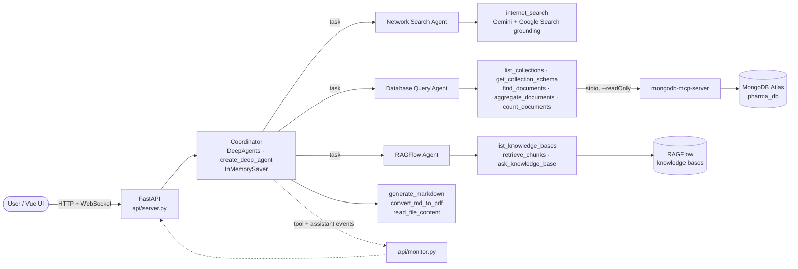

# Deep Search

[](https://github.com/pat-CIMAR-UF/deep_search/actions/workflows/tests.yml)
[](LICENSE)


A multi-agent research assistant for a mock pharmaceutical company. A streaming
[DeepAgents](https://github.com/langchain-ai/deepagents) coordinator delegates to three
specialists — public web search (Gemini with Google Search grounding), the company's MongoDB
business database (read-only, through the official `mongodb-mcp-server`), and internal
documents in RAGFlow knowledge bases — then answers with cited sources and can write
downloadable Markdown and PDF reports. FastAPI serves the Vue UI, the HTTP API, and live
WebSocket progress on one port.

## Architecture



Sub-agents are plain dictionary specs (`agent/subagents/*.py`) whose prompt text lives in
`prompt/prompts.yaml`. The coordinator never sends private database rows or document contents
to public search; retrieved content is treated as data, not instructions.

## Quickstart

Requirements: Python 3.13+ with [uv](https://docs.astral.sh/uv/), Node.js >= 22.13 (runs
`mongodb-mcp-server`), a MongoDB Atlas cluster, access to a RAGFlow server (through an SSH tunnel
by default, see [Knowledge base setup](#knowledge-base-setup)), and API keys for the coordinator
model (DeepSeek by default) and Gemini.

```bash
git clone https://github.com/pat-CIMAR-UF/deep_search.git && cd deep_search
uv sync                                   # Python dependencies
npm install -g mongodb-mcp-server@3       # MongoDB MCP server (read-only at run time)
cp .env.example .env                      # fill in the values
uv run python scripts/seed_mongo.py       # load the mock business data into Atlas
uv run main.py                            # http://localhost:8000
```

Validate the install without live services: `uv run pytest` (536 tests, all external services
mocked). A built UI is included; see [Development](#development) to rebuild it.

## Using the app

- **Modes.** *Auto* lets the coordinator choose specialists; *Database query*, *Web search*,
  and *Knowledge base* direct the request to one specialist.
- **Live progress.** Tool and sub-agent activity streams over WebSocket. Status polling and
  snapshots recover interrupted connections; refreshing restores the conversation.
- **Stop request** cancels orchestration. A read-only external call already in flight may finish
  in the background; its late events are ignored. Requests time out after five minutes.
- **Attachments.** Up to five files: UTF-8 text (TXT/MD/CSV/TSV/JSON/LOG/SQL, 64 KB each, under
  99,000 bytes total) or PDF/Word/Excel documents (10 MB each). Text is supplied as reference
  data; documents are read with the file tool. Uploads do not modify RAGFlow knowledge bases.
- **Reports.** Answers are saved as Markdown; requested reports can also be generated as PDF.
  Files and conversation state persist under the git-ignored `output/` directory.
- This is a local, single-user app: session IDs separate conversations, not authenticated
  users. Run one server worker.

The API contract is documented in [`docs/api文档.md`](docs/api文档.md). `GET /api/health`
reports registered capabilities, not provider connectivity.

## Configuration

All settings live in `.env` at the project root (git-ignored). `.env.example` lists every
variable:

| Variable | Purpose |
|---|---|
| `LLM_PROVIDER` | Coordinator model provider: `deepseek` (default in `.env.example`) or `qwen` |
| `DEEPSEEK_API_KEY`, `DEEPSEEK_MODEL` | DeepSeek API (default model `deepseek-flash`) |
| `QWEN_REMOTE_BASE_URL`, `QWEN_REMOTE_API_KEY`, `QWEN_MODEL` | Self-hosted OpenAI-compatible coordinator when `LLM_PROVIDER=qwen` |
| `GEMINI_API_KEY`, `GEMINI_MODEL` | Web search specialist (Google Search grounding) |
| `RAGFLOW_BASE_URL`, `RAGFLOW_API_KEY`, `RAGFLOW_DATASET` | Knowledge-base specialist: API base URL (default `http://localhost:8080`, the SSH tunnel's local end), API key, optional default knowledge base(s) |
| `MONGODB_URI`, `MONGODB_DATABASE` | Business database (Atlas `mongodb+srv://` string with `/pharma_db`) |
| `MONGODB_MCP_COMMAND`, `MONGODB_MCP_ARGS` | Optional: how the MCP server is launched (default: global binary, else `npx`) |
| `TAVILY_API_KEY` | Optional alternative web search tool (not active) |
| `DEEP_SEARCH_OUTPUT_DIR` | Optional session storage location (default `output/`) |

Restart the backend after changing `.env`; clients are cached in memory.

## Database setup

The seed data lives in `mongo/seed/*.json` — a mock pharmaceutical business database with three
collections: `drugs` (10 documents), `inventory` (30 batches) and `sales_records` (20 orders).
The Database Query Agent never talks to MongoDB directly: it calls the official
[`mongodb-mcp-server`](https://github.com/mongodb-js/mongodb-mcp-server) over stdio, which the
backend spawns once per process with `MDB_MCP_READ_ONLY=true`.

### 1. Install Node.js and the MCP server

On Ubuntu / WSL (via [nvm](https://github.com/nvm-sh/nvm)):

```bash
curl -fsSL https://raw.githubusercontent.com/nvm-sh/nvm/v0.40.3/install.sh | bash
. ~/.nvm/nvm.sh && nvm install 22 && nvm alias default 22
npm install -g mongodb-mcp-server@3
mongodb-mcp-server --version
```

Start the backend from a shell where `node` is on `PATH` (a new terminal after installing nvm).

### 2. Create the Atlas database user and network access

In MongoDB Atlas: *Database Access* → add a user (for example `deepagents`) with **readWrite** on
`pharma_db` (seeding needs write access; the app itself is read-only through the MCP server),
and *Network Access* → add your current public IP. Copy the `mongodb+srv://` connection string
into `MONGODB_URI` in `.env`, including `/pharma_db` as the default database.

### 3. Load the seed data

```bash
uv run python scripts/seed_mongo.py
```

Expected output: `drugs: 10 documents`, `inventory: 30 documents`, `sales_records: 20 documents`.
The script drops and recreates the three collections and their indexes, so it is safe to re-run.

### 4. Viewing the data

Any MongoDB client works — `mongosh "$MONGODB_URI"`, MongoDB Compass, or the Atlas Data Explorer.
Example aggregations the agent typically runs:

```javascript
db.inventory.aggregate([{ $group: { _id: "$drug_id", stock: { $sum: "$quantity_on_hand" } } },
                        { $sort: { stock: -1 } }])
db.sales_records.aggregate([{ $group: { _id: "$region", orders: { $sum: 1 }, revenue: { $sum: "$total_amount" } } },
                            { $sort: { revenue: -1 } }])
```

Quick check through the same tools the agent uses:

```bash
uv run python -c "from tools.mongo_tools import list_collections; print(list_collections.invoke({}))"
```

## Knowledge base setup

The Knowledge-base specialist follows the conventions of the `RAGFlow_Example` command-line client:
knowledge bases (RAGFlow datasets) are addressed by name and chat assistants are derived from them.

1. **Reach the server.** RAGFlow runs on a remote host; open an SSH tunnel and leave it running
   (`RAGFLOW_BASE_URL` is the tunnel's local end):

   ```bash
   ssh -N -L 8080:localhost:80 <ragflow-host>      # web UI and API at http://localhost:8080
   ```

   Put the API key from the web UI (avatar menu → API) in `RAGFLOW_API_KEY`. `RAGFLOW_DATASET`
   optionally names the knowledge base(s) used when a question does not name one (comma-separated).
   If your `.env` predates this setup and still has `RAGFLOW_API_URL`, rename it to `RAGFLOW_BASE_URL`
   or remove it; the old value otherwise overrides the tunnel default.
2. **Check what is there.** `uv run python -m ragflow.cli --list` prints every knowledge base with
   its document and chunk counts and the assistants linked to it.
3. **Add documents.** `uv run python -m ragflow.cli --dataset benefits --add handbook.pdf --chunk-method manual`
   creates the knowledge base if needed, uploads the file (files already present by name are skipped),
   starts parsing and waits for it to finish. Re-parsing a file requires deleting it in the web UI first.
4. **Ask.** `uv run python -m ragflow.cli --dataset handbook "What is the usual adult dose of amoxicillin?"` answers
   through the chat assistant linked to exactly that set of knowledge bases (created as
   `<name>-assistant`, or `<a>+<b>-assistant` for several, when none exists); `--retrieve --top 5`
   shows the matching chunks without the LLM. The agent's tools do the same: `list_knowledge_bases`,
   `retrieve_chunks` and `ask_knowledge_base`.

Answers cite passages as `[ID:n]`; the `Sources` list maps each marker to a document and snippet.
Each question runs in a temporary session that is removed afterwards. The assistant's LLM, prompt
and retrieval settings are configured in the RAGFlow web UI, not in this repository. The code
targets RAGFlow v1.0.0-rc1, whose chat completion endpoint and document status fields differ from
`ragflow-sdk` 0.27.2 (details in `ragflow/service.py`).

## Evaluation

`evals/` holds the evaluation harness (details in `evals/README.md`):

- `evals/run_baseline.py`: the Day 1 latency/token/cost baseline (`evals/baseline.json`).
- `evals/golden/v1.jsonl`: 111 golden rows across the three specialists and coordinator routing,
  validated by `uv run pytest evals/test_golden_schema.py`.
- `evals/run_golden.py` records answers and tool traces per row; `evals/promptfoo/` grades them with
  code graders (answer, routing, governance, citations) and an LLM judge (groundedness,
  completeness, report quality) whose rubrics live in `prompt/prompts.yaml`; Ragas scores the
  knowledge-base rows; `evals/score.py` writes the scorecard to `evals/reports/`.
- `evals/calibration/` samples outputs for hand grading and reports judge-versus-human agreement.

## Development

```bash
uv run pytest                          # full suite; external services are mocked
uv run pytest tests/test_mongo_tools.py tests/test_mcp_client.py   # database path
uv run python -m agent.prompts         # inspect the YAML prompts
cd ui && npm ci && npm run build       # type-check and rebuild the front end into ui/dist
cd ui && npm run dev                   # Vite dev server; proxies /api and /ws to :8000
```

The GitHub Actions workflow in `.github/workflows/tests.yml` runs the suite on every push and
pull request. Restart the backend after changing Python code, prompts, or `.env`; rebuild the
UI before expecting Vue changes in the FastAPI-served bundle.

Live checks against configured services:

```bash
uv run python -c "from tools.mongo_tools import list_collections; print(list_collections.invoke({}))"
uv run python -c "from tools.ragflow_tools import list_knowledge_bases; print(list_knowledge_bases.invoke({}))"
uv run python -m ragflow.cli --list
uv run python -c "
from tools.gemini_tool import internet_search
r = internet_search.invoke({'query': 'latest stable Python release', 'max_results': 3})
print(r['answer'][:300]); print(r['sources'])
"
```

## Project layout

```
agent/
  main_agent.py              # DeepAgents coordinator, streaming runner
  llm.py                     # chat model used by the agents
  prompts.py                 # loads prompt/prompts.yaml
  subagents/
    internet_search_agent.py # web search sub-agent
    database_query_agent.py  # MongoDB sub-agent
    knowledge_base_agent.py  # RAGFlow sub-agent
api/
  server.py                  # FastAPI app: HTTP API, WebSocket progress, static UI
  context.py                 # per-request session/thread context (ContextVar)
  monitor.py                 # tool-call progress reporting (WebSocket / console)
prompt/prompts.yaml          # main-agent and sub-agent prompts
ragflow/
  rag_config.py              # RAGFLOW_* settings
  service.py                 # RAGFlow service layer: knowledge bases, assistants, completions, ingestion
  cli.py                     # command-line client (uv run python -m ragflow.cli)
mongo/seed/*.json            # mock pharmaceutical database seed data
scripts/seed_mongo.py        # loads mongo/seed into MongoDB
tools/
  gemini_tool.py             # internet_search via Gemini + Google Search grounding
  mcp_client.py              # persistent stdio session to mongodb-mcp-server
  mongo_tools.py             # read-only MongoDB tools for the database agent
  tavily_tool.py             # internet_search via Tavily
  ragflow_tools.py           # knowledge-base tools: list_knowledge_bases, retrieve_chunks, ask_knowledge_base
  markdown_tools.py, pdf_tools.py, upload_file_read_tool.py  # report and file tools
utils/                       # path resolution, Markdown -> PDF conversion
docs/                        # API contract (api文档.md) and the long-form project write-ups
evals/                       # golden set, graders, promptfoo harness, scorecards
ui/                          # Vue + Vite front end (built bundle served by FastAPI)
```

## Documentation

- [`docs/api文档.md`](docs/api文档.md) — HTTP and WebSocket API contract
- [`docs/Deep_Search_Project_Documentation.md`](docs/Deep_Search_Project_Documentation.md) — long-form project write-up (English)
- [`docs/深度搜索项目文档.md`](docs/深度搜索项目文档.md) — the same write-up in Chinese
- [`CLAUDE.md`](CLAUDE.md) — working notes for AI coding assistants

## License

[MIT](LICENSE) © 2026 Yiqun Wang
